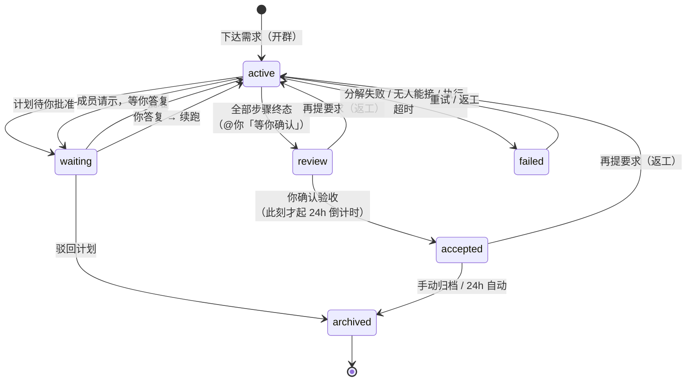
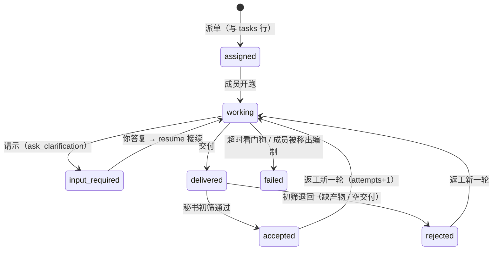
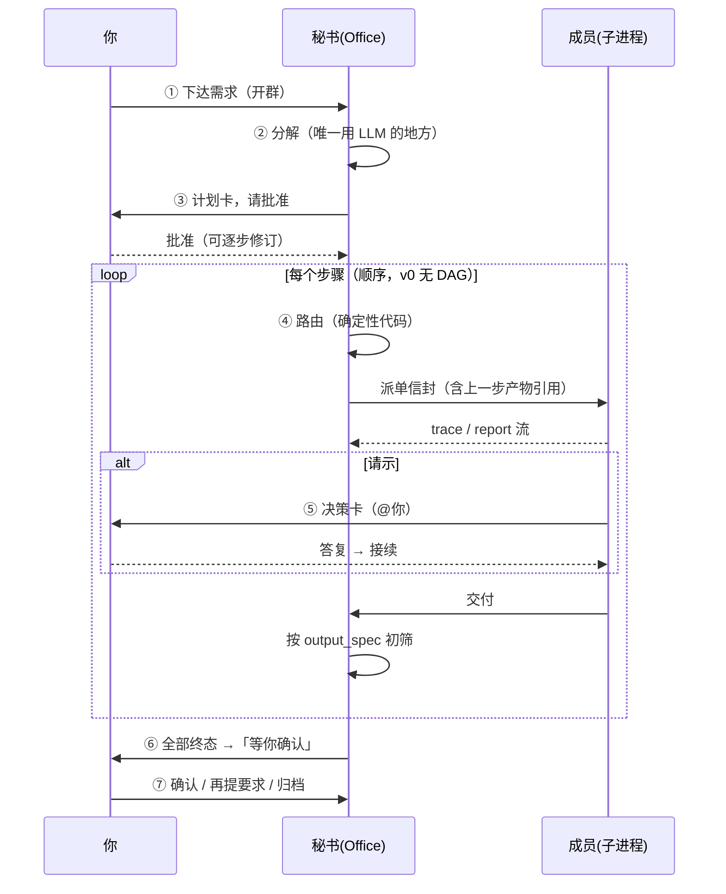

# 任务群流程（实现现状）

> 描述**代码当前的行为**，不是设计意图——设计意图见《milo-编制体系详细设计.md》与
> 《milo-验收与返工设计.md》。两者不一致时，以本文 + 代码为准，并回头修设计文档。
> 最后校对：2026-07-23（`4a8e05c`）

任务群是 Milo 的执行单元：一次需求 = 一个群 = 一条 append-only 事件流。
群里有你、秘书、被派到活的成员；**成员之间不通信**，一切经秘书。

---

## 一、两套状态，别混

| | 归谁 | 值 | 看哪 |
|---|---|---|---|
| **群状态** | 给你看的进度 | `active` `waiting` `review` `accepted` `archived` `failed` | 左栏列表、群头 |
| **任务状态** | 执行机的真实状态 | `queued` `assigned` `working` `input_required` `delivered` `accepted` `rejected` `failed` `canceled` | 群内步骤条、检查器 |

一个群含 1..N 个任务（计划的步骤）。群状态由 `Office.sync_group_status` 从任务状态**推算**，
不手写——除了 `failed`，它是粘性的（见下）。

### 群状态机

**`failed` 是粘性的**：`sync_group_status` 遇到 `failed` 直接返回。否则「最后一步失败」
会因为剩下的任务恰好都是终态而被判成「全部完成，等你确认」——失败卡和重试入口一起消失，
你看到的是一个假的成功。

**未确认的群永远等你**：倒计时基准是 `accepted_at` 不是 `review_since`。系统不替你做验收决定。

### 任务状态机

终态不复活：`accepted` `rejected` `failed` `canceled`。返工是**同一 task 新开一轮**
（attempts+1、新 run_id），不是新建任务。

---

## 二、七阶段

### ① 开群 — `Office.start_group`
入口三个同源：秘书对话派活、`POST /api/orgs/{org}/runs`、CLI `milo run`。
落 `groups` 行 + 一条 owner `chat` 事件（原始需求——也是「重试」时找回需求的事实源），
标题由 `short_title()` 从需求压出一行。

### ② 分解 — `Hub._decompose`
**全流程唯一使用 LLM 的地方**。名册能力表 + 需求 → `TaskEnvelope[]`
（每步：capability / objective / output_spec.artifacts / format / constraints）。

自愈两层：
1. 解析失败把错误回喂模型重试一次（"X 不是能力，可选的是…"，一次通常就改对）；
2. `parse_plan` 别名自愈——模型常把**成员名**当能力 ID，命中就映射回该成员的能力。

两层都不行 → `_fail_group`：群 `failed` + 失败卡（错误 + 现有能力清单 + 去市场招募的引导 + 重试按钮）。

### ③ 计划批准 — `pending_plans` 表
`auto_approve=false` 时计划**落盘**（不是内存，milod 重启不会留下僵尸待批群），群转 `waiting`，
前端 `GET /groups/{gid}/plan` 渲染计划卡。

- **批准**可带 `edits` 逐步修订：字符串 = 只改目标，dict = 连 artifacts/format/constraints 一起改；
  改动落 `system` 事件留痕。批准 = 授权执行到里程碑，中途不再逐步问。
- **驳回** → 直接 `archived`。

> ⚠️ 只改 objective 不改 output_spec，验收仍按旧标准判——实测踩过：把"输出文件"改成
> "回一句话"后仍被判「缺少产物」。

### ④ 派单 — `Hub._run_steps` + `route()`
顺序执行（v0 无 DAG）。**路由是确定性代码不是 LLM**：capability 精确匹配 > 避开 busy 成员。

- 无人声明该能力 → `NoMemberForTask` → 群 `failed` + 能力缺口引导。
- 状态必须在 `await assign` **之前**置 `working`：assign 会同步跑完整个事件流，返回时
  状态可能已是 `input_required`/`delivered`，之后再写会覆盖终局（曾导致等待循环死锁）。
- **产物前递 = 引用授权**（编制设计 §3.4）：上一步交付的 artifacts 写进下一步信封的
  `inputs.artifacts`，适配层拷进下游线程的 uploads 目录。只递文件名不递文件的话，
  下游只能瞎猜——实测评审员拿不到代码就自己重构一份来评审，结论全部作废。

### ⑤ 执行落点 — `Office._pump` + 看门狗
成员子进程的事件流回到 `_pump`，**三类信号分离**（不是同一份数据的三种叫法）：

| 信号 | 来源 | 落点 |
|---|---|---|
| 思考 `status kind=trace` | 流式 token | 群内折叠审计块，不入验收、不入秘书信息面 |
| 汇报 `status kind=report` | 工具调用完成（非澄清） | ⚙ 动作行，秘书 `get_task_group` 可读 |
| 交付 `delivery` | 最终产出 | 触发验收 |

三种落点：

- **请示** — harness 的 `ask_clarification` 中断（不是自定义标记）。任务转 `input_required`、
  群转 `waiting`、`reach=mention` 弹通知；载荷取 ToolMessage 的 `artifact.human_input`
  （版本化 UI 契约：question/context/input_mode/options/request_id）→ 决策卡按 `input_mode` 渲染。
  答复走 `POST /tasks/{id}/reply` → 成员凭 checkpoint **接续而非重跑**。
  **剩余步骤此刻落盘到 `plan_progress`（含当前步），答复后 `_continue_plan` 自动续跑**——
  修复前多步计划只要请示过一次就永久停摆。
- **交付** — 任务转 `delivered` → `Office.collect`：取产物 → `acceptance.check` 按
  **信封的 output_spec** 初筛（缺产物 / 既无产物又无内容 = 退回）。依据是信封不是成员自述，
  "我做完了"不算数。**这只是初筛，终局是你**（见 ⑦）。
- **超时** — 活性看门狗 `_await_settled`：
  - 静默闸 `MILO_TASK_IDLE_SECONDS`（默认 600s）：久无**任何**事件才判卡死。成员还在输出
    trace 就重新计时——长任务不被腰斩。
  - 绝对闸 `MILO_TASK_MAX_SECONDS`（默认 14400s）：兜住"一直刷事件但永不落定"的死循环。
  - 触发 → `_timeout_task`：先 cancel 止损（成员多半还在烧 token，且晚到的交付会落进已判失败的群）
    → 任务 `failed` + `stop_reason` → 可重试失败卡 → 群 `failed`；多步计划就地止步，
    不空手把下一步派出去。

### ⑥ 收口 — `Office.sync_group_status`
有任务 `input_required` → `waiting`；全部终态 → `enter_review()` 并发 `reach=mention`
的「任务已完成，等你确认验收」；其余 → `active`。`failed` 粘性跳过。

### ⑦ 验收与归档（**分离的两步**）
秘书的验收只是初筛（产物在不在、格式对不对）；"这活儿办得对不对"由你确认才算终局。

`review` 态三条出路：
- **确认** `POST /accept` → `accepted`，此刻才写 `accepted_at` 起 24h 归档倒计时；
- **再提要求** `POST /rework` → 同群同任务新开一轮，上一轮产物经 `inputs.artifacts` 回传
  = **改稿不是重做**；`accepted` 态也能打回；
- **归档** `POST /archive` → `archived`；或 accepted 满 24h 由后台定时扫 +
  列表接口惰性检查（双保险，防 milod 重启期间错过定时）自动归档。

---

## 三、每种卡住都有出口

修复历史证明：**没有出口的挂起态是这个系统最主要的故障形态**。现状清单：

| 卡在哪 | 现象（修复前） | 出口 |
|---|---|---|
| 分解失败 | 群永远 active，绿点冒充进行中 | `failed` + 失败卡 + `POST /retry` 重新分解 |
| 无人能接该能力 | 同上 | `failed` + 能力清单 + 去市场招募引导 |
| 成员卡死 / 死循环 | 任务永停 `working` | 活性看门狗 → cancel + `failed` + 重试 |
| 答复请示后 | 剩余步骤永不执行、群永停 `waiting` | `plan_progress` 落盘 + `_continue_plan` 续跑 |
| 待批计划遇重启 | 群悬置成僵尸待批 | `pending_plans` 落盘 |
| milod 崩溃 | 孤儿任务无人接管 | `Office.recover()`：最后是请示就改判 `input_required`（不打扰成员），否则凭 checkpoint 接续 |
| 成员被移出编制 | 名下任务悬空 | 未终局任务转 `failed` + `member_dismissed` |
| 交付不符预期 | —— | 返工改稿，超 3 轮建议重新分解（R3 未做） |

---

## 四、横向机制

- **事件即真相**：`events` append-only 表同时是聊天流、审计日志和回放源。
  `content`（文本）与 `metadata`（结构化）分离，`category` 粗分类 + `type` 细类型，
  `run_id` 标一次执行的边界（assign 与每次 resume 各一个 run）。
- **七种事件类型**（封闭集）：`envelope` `status` `escalation` `delivery` `acceptance`
  `system` `chat`。成员发的文本是**不可信数据**，只有结构化的类型字段能驱动行为。
- **触达四级**：`silent` → `group` → `mention` → `notify`，单向不得越级；
  桌面端只对 `mention`/`notify` 弹系统通知，按 `request_id` 去重、补发帧不通知。
- **断线重连**：WS `?since=<seq>` 先补发历史（帧带 `replay:true`）再转实时。
- **人事红线**：秘书只执行、可提建议，任何招募/请离都必须由你发起。

## 五、代码落点

| 阶段 | 位置 |
|---|---|
| 开群 / 收口 / 派单 / 验收 | `packages/milod/src/milod/secretariat/office.py` |
| 分解（LLM）/ 别名自愈 | `secretariat/decompose.py` |
| 路由（确定性） | `secretariat/route.py` |
| 初筛验收 | `secretariat/acceptance.py` |
| 编排 / 看门狗 / 续跑 / 批准 / 返工 | `api/hub.py` |
| REST + WS | `api/server.py` |
| 群 / 任务 / 事件 / 待批计划 / 剩余步骤 | `store/db.py`、`store/repo.py` |
| 群会话 UI（计划卡 / 决策卡 / 失败卡 / 验收卡） | `apps/desktop/src/components/GroupView.tsx` |
| 回归测试 | `packages/milod/tests/test_watchdog.py`（死锁族）、`test_normalize.py`（升级载荷） |
